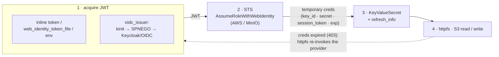

# blobsso  *(working name — may change)*

[](https://github.com/phrrngtn/blobsso/actions/workflows/MainDistributionPipeline.yml)

> **Note:** This code is almost entirely AI-authored (Claude, Anthropic), albeit under close human supervision, and is for research and experimentation purposes. Successful experiments may be re-implemented in a more coordinated and curated manner.

A **DuckDB C++ extension** that turns an **enterprise identity** — a JWT, or a
**Kerberos ticket** via SPNEGO — into **temporary, auto-rotating S3 credentials**, so
DuckDB `httpfs` reads/writes an S3-compatible store (AWS, MinIO, …) with **no static
access keys**. It registers an `sso` provider for the `s3` secret type:

```sql
-- Kerberos / SPNEGO: no password, no static keys — the OS ticket becomes S3 creds
CREATE SECRET lake (
  TYPE s3, PROVIDER sso,
  oidc_issuer  'https://keycloak.example/realms/lake',
  client_id    'minio',
  sts_endpoint 'https://minio.example:9000/',
  endpoint     'minio.example:9000', region 'us-east-1'
);

-- …or hand it a JWT you already hold (file / env / inline):
CREATE SECRET lake (TYPE s3, PROVIDER sso, token '<jwt>', sts_endpoint '…', endpoint '…');
```

Flow: **acquire a JWT** (inline `token` / `web_identity_token_file` / `AWS_WEB_IDENTITY_TOKEN_FILE`
env / or **Kerberos SPNEGO** against an OIDC issuer) → **STS `AssumeRoleWithWebIdentity`**
(AWS STS or MinIO STS) → **temporary credentials** in a `KeyValueSecret` → `httpfs`
consumes them exactly like static keys, and they **auto-rotate** on expiry.



## Lightweight by design — no heavyweight dependencies

The goal is enterprise SSO-style auth with the **smallest possible footprint**. The
extension is a thin shim over the DuckDB host; it links **no** large libraries:

- **No HTTP library.** Every request — the STS POST, OIDC discovery, the SPNEGO
  auth-code GET, the token exchange — rides DuckDB's **core `HTTPUtil`** (the same HTTP
  abstraction `httpfs` implements, obtained via `HTTPUtil::Get(db)`). We *deliberately*
  reuse the host's HTTP stack instead of linking libcurl/cpr.
- **No JSON library.** OIDC discovery and token responses are read with a few lines of
  string scanning — the fields we need (`authorization_endpoint`, `token_endpoint`,
  `access_token`) are simple, well-formed strings.
- **No XML library.** STS responses are parsed by pulling a handful of
  `<AccessKeyId>` / `<SecretAccessKey>` / `<SessionToken>` / `<Expiration>` tags directly.
- **No Kerberos/GSSAPI at link time.** The SPNEGO path **`dlopen`s** GSS-API
  (`libgssapi_krb5` on Linux, `GSS.framework` on macOS, SSPI on Windows) **at runtime**,
  and only when you use the `oidc_issuer` flow. The token/file/env paths touch no
  security library at all. The only link-time additions are the dl loader
  (`${CMAKE_DL_LIBS}`) and, on Windows, `secur32` for SSPI.

Net effect: the "real" work is one STS exchange plus an optional SPNEGO handshake —
everything else (HTTP, TLS, the S3 client) is borrowed from the DuckDB host.

## Why a C++ extension (the security API is not in the C interface)

blobsso **must** be C++. The DuckDB **secret-provider** surface —
`CreateSecretFunction`, `KeyValueSecret`, `RegisterSecretType`,
`ExtensionLoader::RegisterFunction`, and `HTTPUtil` — lives only in the **C++ core**.
It is **not** exposed through the stable **C extension API**: `duckdb.h` and
`duckdb_extension.h` contain **zero** `secret` symbols (verified at the header level),
whereas ordinary scalar-function registration *is* in the C API. So a stable-ABI,
version-independent C extension **cannot** register a secret provider — anything
security-related has to go through the C++ interface, which is why this is a C++
extension built against a pinned duckdb version.

## Token acquisition (the `sso` provider)

| Source | Parameters |
|---|---|
| Inline JWT | `token` |
| Token file | `web_identity_token_file` (or `AWS_WEB_IDENTITY_TOKEN_FILE` env) |
| **Kerberos / SPNEGO** | `oidc_issuer`, `client_id`, `client_secret`, `redirect_uri`, `allow_http_negotiate` |

**Kerberos/SPNEGO** (`oidc_issuer` set): `kinit` ticket → `spnego::GenerateTokenForUrl`
(the dlopen'd GSS-API, from the shared [`spnego-token`](https://github.com/phrrngtn/spnego-token)
submodule) → OIDC discovery → proactive
`Authorization: Negotiate` auth-code GET → token exchange → JWT. The client's
`krb5.conf` should set **`dns_canonicalize_hostname = false`** so the requested SPN
matches the issuer host (`HTTP/<issuer-host>`) rather than a DNS-canonicalized name.

By default SPNEGO requires **HTTPS** (replay protection); `allow_http_negotiate true`
opts into plain HTTP when the transport is already encrypted by an overlay (e.g.
WireGuard/Tailscale).

## Scalar functions (preemptive Negotiate tokens)

The same [`spnego-token`](https://github.com/phrrngtn/spnego-token) atom is also exposed
as UDFs, so you can mint a token and drop it into any request — an `EXTRA_HTTP_HEADERS`
entry on a `TYPE http` secret, ad-hoc SQL, etc. All are `VOLATILE` (a fresh token per call).

| Function | Returns |
|---|---|
| `negotiate_token(url)` | base64 SPNEGO token for `HTTP/<host>` (raises on failure) |
| `negotiate_token(url, service)` | token for `<service>/<host>` — `LDAP`, `cifs`, `host`, … |
| `negotiate_token_describe(url)` | a JSON diagnostics blob (SPN, provider, token-or-error); never raises |
| `negotiate_token_from_json(config)` | strict JSON property-bag `{"url"\|"host", "service", "allow_insecure"}` → token |

```sql
CREATE SECRET kerb (TYPE http, EXTRA_HTTP_HEADERS MAP {
    'Authorization': 'Negotiate ' || negotiate_token('https://intranet.example/')
});
```

## Refresh / auto-rotation

STS credentials are short-lived (minutes to ~an hour), so the provider is built to be
**re-runnable**, and the secret carries everything needed to re-run it:

- On creation, blobsso stores **all** the original `CREATE SECRET` options as a
  `refresh_info` struct inside the secret (alongside the temp creds and their
  `expiration`).
- When an S3 request fails because the credentials have expired, **httpfs**
  (`CreateS3SecretFunctions::TryRefreshS3Secret`) reconstructs the `CreateSecretInput`
  from `refresh_info`, calls `CreateSecret` again — which **re-invokes this provider** —
  and retries the S3 request with the fresh secret. No user action, no re-issuing
  `CREATE SECRET`.

What "re-invoke" actually does depends on the token source:

| Source | On refresh |
|---|---|
| `oidc_issuer` (Kerberos/SPNEGO) | **Full re-acquire** — new SPNEGO handshake → new JWT → new STS creds. Requires a still-valid Kerberos ticket (TGT) at refresh time. |
| `web_identity_token_file` | Re-reads the file → new STS creds. Works with an external token-rotation agent (e.g. an EKS/IRSA-style projected token). |
| inline `token` | Re-runs the STS call with the *same* JWT; only useful while that JWT is still valid — a static token cannot be renewed from inside the secret. |

Caveats, stated plainly:

- Refresh is **reactive**, not a proactive timer: it fires on an expired-credential
  failure and retries, so the first call after expiry pays one failed-then-retried
  round-trip. (The `expiration` is stored in the secret but blobsso does not itself run
  a background refresher.)
- For the SPNEGO path, refresh needs a **valid Kerberos ticket** when it runs. If the
  TGT has also expired, the refresh fails and you re-`kinit` — the long-lived secret of
  record is the Kerberos credential, not an S3 key.
- Verified end-to-end: re-invoking the provider yields a **different** `key_id` each
  time, confirming genuinely fresh STS credentials.

## Build, test, CI

- `make` builds against pinned **duckdb v1.5.4** + `extension-ci-tools` + the
  [`spnego-token`](https://github.com/phrrngtn/spnego-token) submodule (clone
  `--recursive` to also get its nested `nlohmann/json`); `make test` runs the suite. (`httpfs` is `INSTALL`/`LOAD`ed at test time, not compiled
  in — it supplies the s3 secret *type* and the `HTTPUtil` used for the STS call.)
- **GitHub Actions** builds the full distribution matrix (linux amd64/arm64, macOS
  amd64/arm64, windows mingw+MSVC, wasm). A **Forgejo** workflow additionally builds on
  self-hosted runners.

## Layout

```
CMakeLists.txt                     # links only ${CMAKE_DL_LIBS} (+ secur32 on Windows)
src/blobsso_extension.cpp          # the 'sso' provider: token acquisition + STS + KeyValueSecret
src/include/blobsso_extension.hpp
third_party/spnego-token/          # submodule: shared SPNEGO atom (+ nested nlohmann/json)
test/sql/blobsso.test              # sqllogictest: registration + input validation
test/mock_sts_test.py              # mock-STS round-trip integration test
.github/workflows/                 # multi-arch distribution pipeline
.forgejo/workflows/                # self-hosted build (dc1 + Mac runners)
duckdb/  extension-ci-tools/       # submodules, pinned to v1.5.4
```

See `CONTEXT.md` for the full design/decision history.
